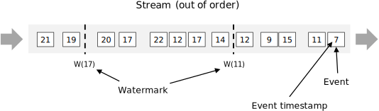

# 窗口计算

在上一个章节中，我们尝试了有状态计算，分别实现了机器峰值、均值、中位值的监控。但是我们做的还远远不够，这节，我们将借助Flink提供的事件时间、watermark以及三种窗口计算（滑动窗口、计数窗口、会话窗口）实现更加稳定可靠的监控程序。


## 1. 窗口类型

什么是窗口呢？可以这么理解，在批处理中，我们一般经历如下过程：

1. 拉取所有数据
2. 计算
3. 输出结果

可以这么说， **一个批处理中，对应的窗口就是全部的数据。 **在这里窗口的意义显得有点多余。

但是在流处理中却是必须的，因为**流数据是无穷无尽，类似一条不断的河流一样。**这里就必须使用窗口来界定需要计算的数据范围。窗口的概念在监控系统中也十分的重要。例如，我们有某个域名每分钟的流量，我们想监控某个域名的平均带宽是否低于某个指定阈值。

> 带宽的含义：一些主机服务商会给带宽以不同的含义。在这里，带宽几乎变成一个单位时间内的流量概念。意思是单位时间内的下行数据总量。意味着如果一个公司提供每月2GB的带宽，意思就是用户每月最多只能下载2GB的内容。 —— 《维基百科》
>
> 这里为了简化：
>
> 1. 流量 = B（字节）当前流量值 
>
> 2. 带宽 = Mbps 带宽描述的是某段时间内，单位时间的流量。 其值 = （周期内总流量值）* 8 / 时间 / 1024 / 1024 

显然，我们的监控通常是监控当前的实时带宽更有价值。下面，我们分别来实现几种监控：

1. 每分钟计算当前这一分钟的实际带宽值，若低于100Mbps则产生报警
2. 每15s计算最近1分钟的实际带宽值，若低于100Mbps则产生报警

显然，方式2更加敏感，在监控中也更为常用。

对于方式1，有一个很重要的特性，即运行频率以及查看的时间区间（窗口大小）均设置为1分钟，是一种滚动的方式（把它想象成一个正方形滚动），这叫做 **滚动窗口**，它每次计算的数据是独一无二，无任何重叠的。


而对于第二项监控，它同样有一个很特殊的特性：它的运行频率以及查看的时间区间（时间窗口）不一致，是一种不断滑动，不断计算的过程，计算的过程中会有一部分数据被多次计算。


下面，我们来尝试编写实现代码：

``` java
StreamExecutionEnvironment env = StreamExecutionEnvironment.getExecutionEnvironment();
DataStream<String> text = env.socketTextStream("localhost", 8080);
text.map(new MapFunction<String, Tuple2<String, Long>>() {
    @Override
    public Tuple2<String, Long> map(String s) throws Exception {
        String[] items = s.split(" ");
        // 返回 channel -> 流量
        return new Tuple2<>(items[1], Long.parseLong(items[2]));
    }
}).keyBy(0)
        // 滚动窗口
        .timeWindow(Time.minutes(1))
        // 时间窗口
        // .timeWindow(Time.minutes(1), Time.seconds(15))
        .reduce((ReduceFunction<Tuple2<String, Long>>) (stringLongTuple2, t1) -> new Tuple2<>(stringLongTuple2.f0, stringLongTuple2.f1 + t1.f1))
        // 过滤出带宽值低于100Mbps域名
        .filter((FilterFunction<Tuple2<String, Long>>) stringLongTuple2 -> stringLongTuple2.f1 * 8.0 / 60 / 1024 / 1024 < 100)
        .print();
env.execute("BandwidthSlideMonitor");
```

从代码中可以发现，从滚动窗口到滑动窗口的转换非常简单，只要添加一个滑动周期参数即可。

下面测试输入输出：

```
2019-08-28T10:00:00 www.163.com 10000
2019-08-28T10:01:00 www.163.com 100
2019-08-28T10:02:00 www.163.com 100
2019-08-28T10:03:00 www.163.com 1000
```

运行结果：

1. 滚动时间窗口：等待1分钟左右得到输出  (www.163.com,11200) 即我们输入的所有流量值总和
2. 滑动时间窗口：等待15秒左右得到输出  (www.163.com,11200) 即我们输入的所有流量值总和


这里我们发现有个问题，即我们的时间窗口虽然是基于时间滑动的，但是数据却无法关联上时间的特性。即我们运行的时候，窗口说是要拉1分钟的数据，但是这个1分钟的数据的定义是从上次开始至触发期间收集到的数据，和数据所带有的数据时间完全无关。**在监控系统中，数据乱序、延迟是非常常见的，倘若无法基于正确的数据时间计算，很可能会出现错误的结果。因此这就涉及到“时间的概念”。**


### 1.1 时间类型

在流处理中有三种时间的概念：

1. 处理时间（Process Time）
2. 事件时间（Event Time）
3. 摄入时间 （Ingest Time）

对于我们上面的例子中，数据如下，假如我们是在2019-08-28T11:30:00时刻接受到下面这些数据。

```
2019-08-28T10:00:00 www.163.com 10000
2019-08-28T10:01:00 www.163.com 100
2019-08-28T10:02:00 www.163.com 100
2019-08-28T10:03:00 www.163.com 1000
```

倘若我们的逻辑是希望监控最近10分钟内的数据，那么实际上在30分的时候我们希望取到的是20分~30分发生的事情。这个时候我们若使用的是处理时间，那我们关注的是20分~30分期间**收到的数据**而不是实际上这些数据真正发生的时间。因此虽然我们的数据都是一个小时前的数据，我们也能触发计算。

处理时间是三种时间中使用最简单的一种，也是Flink中默认的时间。

但是，处理时间是 **不稳定**，严重依赖数据的时效性，如果数据延迟较大，那么可能在触发计算的时候没办法取到完整的数据，那么就可能导致错误的计算结果。同时，使用数据时间的计算程序无法 "复盘" 历史数据。例如，我们的监控程序修改了计算逻辑，并且我们获取了昨天一整天的数据，现在希望用新逻辑重跑这些数据输出结果，如果使用的是处理时间，由于处理时间依赖于系统时间，所以无法有效复盘。

所有，为了解决上述的问题，Flink 支持了**稳定的事件时间。**

事件时间，顾名思义，就是这条事件真实发生的时间，如上面的例子，分别表示域名在10点连续4分钟的时间。

使用时间时间时，我们就能获得准确的计算，我们复盘数据时，程序可依靠数据时间准确的触发计算。

**事件时间是Flink中最重要的特性之一。也是监控系统报警计算实现回测，保证正确性严重依赖的特性之一。**

最后一种时间是**摄取时间**，即进入Flink程序的时间，有时候，我们的数据没办法打上准确的事件时间，但是又希望比处理时间更精确，那么可以设置为摄取时间。

理想情况下（无任何传输延迟），事件时间（数据产生时间） = 摄入时间 = 处理时间。


## 1.2 编写代码

下面看看如何设置处理时间与事件时间：

``` java
StreamExecutionEnvironment env = StreamExecutionEnvironment.getExecutionEnvironment();
// 设置处理时间,如果不设置的话默认为处理时间
env.setStreamTimeCharacteristic(TimeCharacteristic.ProcessingTime);
```

处理时间的设置非常简单，假如没有设置系统也会默认使用处理时间。

而对于事件时间，**就必须要手工设置。**


对于事件时间的设置，除了上述的 setStreamTimeCharacteristic 方法以外，还有两个必须要做的事情：

1. 指定时间时间列
2. 设置Watermark

对于第一点很好理解，你必须告诉Flink你的事件时间是哪一列，而对于Watermark，我们现在来好好捋一捋概念。


### Watermark

在说watermark的概念前，我们可以先了解下 **数据乱序** 的概念。

如下所示的数据，分别表示顺序的三分钟数据，在上一节中，我们说过理论上数据产生时间 = 数据业务时间 = 数据摄入（接收）时间。

```
2019-08-28T10:00:00 www.163.com 10000
2019-08-28T10:01:00 www.163.com 100
2019-08-28T10:02:00 www.163.com 100
```

然而，可能我们在00分的时候调用了一次数据发送，由于网络原因或者下游组件堆积等原因等到03分才被接收到，而01分以及02分的数据都在产生的时候顺利被接收到，所以对于我们的程序接收到的数据看起来是这样的：

```
2019-08-28T10:01:00 www.163.com 100
2019-08-28T10:02:00 www.163.com 100
2019-08-28T10:00:00 www.163.com 10000
```

因此，数据产生了乱序。**数据延迟，是流式计算中不可避免的，同时也是产生乱序的根本原因。**

除此之外，在一些消息队列中，消息队列的处理机制也可能导致数据乱序，例如在Kafka中，只能保证单个分区中的数据是按照写入顺序，分区与分区间的数据无序的，这就可能导致我们有三条数据，第一条最早的数据在分区1中，而其他数据在分区2。消费程序获取数据时由于是从不同分区获取，并不能保证最早拉到的一定是最早的那条数据。

那么，我们怎么来解决数据乱序的问题呢？

在以前，我们写JStorm程序的时候，为了解决乱序问题，我们想到了 ”延迟等待“ 的方式。设置一个固定的延迟时间，例如1分钟。我们每分钟会计算一次，计算的时候取一分钟的数据，即典型的滚动窗口模式，当设置了数据延迟时，会晚一个周期计算，如下所示：

```
数据时间 	10 11 12 13
系统时间	11 12 13 14
不设置延迟情况下，每分钟取前一分钟的数据点进行计算

数据时间 	10 11 12 13
系统时间	12 13 14 15
延迟时间 = 1分钟
```

这样，我们相当于设置了一个容忍时间，即延迟在1分钟以内的情况下，我们能准确计算。如果数据延迟超过了1分钟的时间，那么我们之前的做法是直接丢弃数据。

**而在 Flink 中，定义的 Watermark 机制，与我们之前自己想的数据延迟设定一定程度上不谋而合，并且更加强大、全面、鲁棒性也更好！**


Watermark 翻译为中文即为水位线。水位线是Flink中用于度量事件时间的机制。Watermark 可以被像数据一样定义在DataStream中，该Stream一般会携带一个时间戳 k ：

```
Watermark(k) 
```

上面的定义表示，事件时间在k之前的已经全部到达。



如图所示，数据不断在产生，图中的数字表示事件时间，而W表示水位线，W(11) 告诉程序此时时间时间低于11的全部到达。

看到这里，有的人可能会有疑惑，我怎么设置水位线，能保证在此之前的数据全部到达呢？

实际上，流式计算中通常是不可能预先确保数据都已到达，Flink 中提供了 Allowed Lateness 机制，让开发者可以选择对滞后于 Watermark 的数据的处理操作：

1. 直接丢弃数据（默认情况）
2. 允许一定的延迟，当我们设定了 allowedLateness(T) 方法，那么当Watermark触发后，还允许有T秒的延迟，若数据在这段时间中到达，会再次触发一次窗口计算逻辑（为了达到这样的效果Flink必须保持窗口状态，直到T时间过后）
3. 单独处理延迟数据，Flink 支持定义一个流，延迟的数据会输出到这个流中

``` java
final OutputTag<T> lateOutputTag = new OutputTag<T>("late-data"){};

DataStream<T> input = ...;

SingleOutputStreamOperator<T> result = input
    .keyBy(<key selector>)
    .window(<window assigner>)
    .allowedLateness(<time>)
    .sideOutputLateData(lateOutputTag)
    .<windowed transformation>(<window function>);

DataStream<T> lateStream = result.getSideOutput(lateOutputTag);
```


### 更完善的带宽监控

讲解完了Watermark，我们继续我们的带宽监控编码工作。这里，我们重新REVIEW下需求：

> 每分钟计算当前这一分钟的实际带宽值，若低于100Mbps则产生报警

关键字为每分钟，计算一分钟的数据。为了使结果是准确的且可复现的，我们使用事件时间，同时使用允许一分钟的数据延迟。超过一分钟延迟到达的数据全部丢弃。

``` java
public class BandwidthMonitorWithEventTime {

    public static void main(String[] args) throws Exception {
        StreamExecutionEnvironment env = StreamExecutionEnvironment.getExecutionEnvironment();
        // 设置事件时间
        env.setStreamTimeCharacteristic(TimeCharacteristic.EventTime);
        DataStream<String> text = env.socketTextStream("localhost", 8080);
        // 在执行任何操作前需要先执行watermark设置
        text.assignTimestampsAndWatermarks(new BoundedOutOfOrdernessTimestampExtractor<String>(Time.minutes(1L)) {
            @Override
            public long extractTimestamp(String element) {
                int time = (int) LocalDateTime.parse(element.split(" ")[0]).toEpochSecond(ZoneOffset.ofHours(8));
                return time * 1000L;
            }
        }).map(new MapFunction<String, Tuple3<Integer,String, Long>>() {
            @Override
            public Tuple3<Integer,String, Long> map(String s) throws Exception {
                String[] items = s.split(" ");
                // 返回 时间 -> channel -> 流量
                Integer time = (int) LocalDateTime.parse(items[0]).toEpochSecond(ZoneOffset.ofHours(8));
                String channel = items[1];
                Long flow = Long.parseLong(items[2]);
                return new Tuple3<>(time, channel, flow);
            }}).keyBy(1)
                .timeWindow(Time.minutes(5),Time.seconds(5))
                .reduce((ReduceFunction<Tuple3<Integer, String, Long>>) (integerStringLongTuple3, t1) -> new Tuple3<>(integerStringLongTuple3.f0,integerStringLongTuple3.f1,integerStringLongTuple3.f2 + t1.f2))
                .map(new MapFunction<Tuple3<Integer, String, Long>, Tuple2<String,Double>>() {
                    @Override
                    public Tuple2<String, Double> map(Tuple3<Integer, String, Long> integerStringLongTuple3) throws Exception {
                        return new Tuple2<>(integerStringLongTuple3.f1,integerStringLongTuple3.f2 * 8.0 / 60 / 1024 / 1024);
                    }
                })
                // 过滤出带宽值低于100Mbps域名
                .filter((FilterFunction<Tuple2<String, Double>>) stringDoubleTuple2 -> stringDoubleTuple2.f1 < 100.0).print();

        env.execute("BandwidthMonitorWithEventTime");
    }
}

```

输入数据

```
2019-08-28T10:00:00 www.163.com 10000
2019-08-28T10:01:00 www.163.com 100
2019-08-28T10:02:00 www.163.com 100
2019-08-28T09:01:00 www.163.com 100
2019-08-28T10:06:00 www.163.com 100
```

输出结果

```
2> (www.163.com,0.0012715657552083333)
2> (www.163.com,0.0012969970703125)
```


在这个代码片段中有几个比较重要的点：

1. env.setStreamTimeCharacteristic(TimeCharacteristic.EventTime) 指定使用事件事件
2. assignTimestampsAndWatermarks 指定事件获取方式以及Watermark生成策略，这里我们使用了自带的 BoundedOutOfOrdernessTimestampExtractor 


下面我们简单看下 BoundedOutOfOrdernessTimestampExtractor 的源码，这有助于我们更好理解Watermark

``` java
/*
 * Licensed to the Apache Software Foundation (ASF) under one
 * or more contributor license agreements.  See the NOTICE file
 * distributed with this work for additional information
 * regarding copyright ownership.  The ASF licenses this file
 * to you under the Apache License, Version 2.0 (the
 * "License"); you may not use this file except in compliance
 * with the License.  You may obtain a copy of the License at
 *
 *    http://www.apache.org/licenses/LICENSE-2.0
 *
 * Unless required by applicable law or agreed to in writing, software
 * distributed under the License is distributed on an "AS IS" BASIS,
 * WITHOUT WARRANTIES OR CONDITIONS OF ANY KIND, either express or implied.
 * See the License for the specific language governing permissions and
 * limitations under the License.
 */

package org.apache.flink.streaming.api.functions.timestamps;

import org.apache.flink.streaming.api.functions.AssignerWithPeriodicWatermarks;
import org.apache.flink.streaming.api.watermark.Watermark;
import org.apache.flink.streaming.api.windowing.time.Time;

/**
 * This is a {@link AssignerWithPeriodicWatermarks} used to emit Watermarks that lag behind the element with
 * the maximum timestamp (in event time) seen so far by a fixed amount of time, <code>t_late</code>. This can
 * help reduce the number of elements that are ignored due to lateness when computing the final result for a
 * given window, in the case where we know that elements arrive no later than <code>t_late</code> units of time
 * after the watermark that signals that the system event-time has advanced past their (event-time) timestamp.
 * */
public abstract class BoundedOutOfOrdernessTimestampExtractor<T> implements AssignerWithPeriodicWatermarks<T> {

	private static final long serialVersionUID = 1L;

	/** The current maximum timestamp seen so far. */
	private long currentMaxTimestamp;

	/** The timestamp of the last emitted watermark. */
	private long lastEmittedWatermark = Long.MIN_VALUE;

	/**
	 * The (fixed) interval between the maximum seen timestamp seen in the records
	 * and that of the watermark to be emitted.
	 */
	private final long maxOutOfOrderness;

	public BoundedOutOfOrdernessTimestampExtractor(Time maxOutOfOrderness) {
		if (maxOutOfOrderness.toMilliseconds() < 0) {
			throw new RuntimeException("Tried to set the maximum allowed " +
				"lateness to " + maxOutOfOrderness + ". This parameter cannot be negative.");
		}
		this.maxOutOfOrderness = maxOutOfOrderness.toMilliseconds();
		this.currentMaxTimestamp = Long.MIN_VALUE + this.maxOutOfOrderness;
	}

	public long getMaxOutOfOrdernessInMillis() {
		return maxOutOfOrderness;
	}

	/**
	 * Extracts the timestamp from the given element.
	 *
	 * @param element The element that the timestamp is extracted from.
	 * @return The new timestamp.
	 */
	public abstract long extractTimestamp(T element);

	@Override
	public final Watermark getCurrentWatermark() {
		// this guarantees that the watermark never goes backwards.
		long potentialWM = currentMaxTimestamp - maxOutOfOrderness;
		if (potentialWM >= lastEmittedWatermark) {
			lastEmittedWatermark = potentialWM;
		}
		return new Watermark(lastEmittedWatermark);
	}

	@Override
	public final long extractTimestamp(T element, long previousElementTimestamp) {
		long timestamp = extractTimestamp(element);
		if (timestamp > currentMaxTimestamp) {
			currentMaxTimestamp = timestamp;
		}
		return timestamp;
	}
}
```

BoundedOutOfOrdernessTimestampExtractor 实现很简单，首先该类继承了 实现了AssignerWithPeriodicWatermarks接口。通过名字可以知道该接口是周期性生成Watermark的。相对的，还有一个AssignerWithPunctuatedWatermarks接口，是通过数据驱动的方式生成Watermark的，AssignerWithPunctuatedWatermarks在流量较高的情况下可能会引起一定的延迟。

除此之外，BoundedOutOfOrdernessTimestampExtractor构造函数需要传入一个允许的延迟时间。

> Watermark 实际上就是通过延迟等待，来解决数据延迟的问题。

接下来对于每条数据会调用 extractTimestamp 方法，获取毫秒级的事件时间，获取的同时，更新当前输入的最大时间戳。然后调用getCurrentWatermark方法获取当前Watermark（最大时间 - 我们构造函数传入的容忍时间）。

我们可以看到，这个过程没有依赖任何系统时间，而全部是使用事件时间，**这保证了程序的准确性、可回测性。**


## 2. 更多高级特性 - 会话窗口

上面我们讲了事件时间、处理时间以及对应的时间窗口机制。

Flink 除了上面提供的几种窗口外，还有一种比较特殊的窗口：会话窗口。

会话窗口指这样的窗口，它需要指定一个活跃时间 t，若过了时间t还未收到数据，窗口就会关闭。

可以把这个理解为会话的生命周期。

如图所示：


由于会话窗口比较少见，具体的代码这里就不再赘述。

详见：[官网文档](https://ci.apache.org/projects/flink/flink-docs-release-1.9/dev/stream/operators/windows.html#session-windows)


## 3. 窗口源码解析

待补充


## 4. 总结

这节我们通过简单的计算带宽监控，学习到了Flink中的三种时间：

1. 处理时间
2. 摄入时间
3. 事件时间

并且学习到了三种时间的区别，以及使用场景。在实践中，我们应该根据监控场景使用特定的时间。

例如，需要灵活多变的情况下，以及对精度要求不高的情况使用处理时间更灵活自由简单。而对于结果要求准确特别是希望程序具有可回测性，那么选择事件时间，那如果没有事件时间怎么办呢？可退而舍之取摄入时间。

我们还学习了三种时间对应的不同窗口机制。这里主要是详细介绍了事件时间窗口的使用，引入了Watermark保证了数据延迟、乱序的可处理性，以及对延迟数据的处理策略。通过上面的知识，我们实现了基于事件时间的带宽监控程序。

最后，我们简要介绍了会话窗口，该窗口在目前的流式计算框架中，仅Flink支持，属于高级特性。

尽管如此，我们的监控程序还有很多点需要完善。例如，在窗口汇聚的过程中，TM宕机了，数据如何保证准确呢？数据在内存中跟着宕机会瞬间丢失。以及，如何执行程序回测呢？

下一节，我们将介绍Flink的另外一个核心特性：检查点及保存点机制。