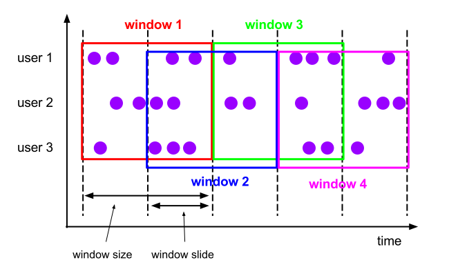

# 窗口计算

在上一个章节中，我们尝试了有状态计算，分别实现了机器峰值、均值、中位值的监控。但是我们做的还远远不够，这节，我们将借助Flink提供的事件时间、watermark以及三种窗口计算（滑动窗口、计数窗口、会话窗口）实现更加稳定可靠的监控程序。


## 1. 窗口类型

什么是窗口呢？可以这么理解，在批处理中，我们一般经历如下过程：

1. 拉取所有数据
2. 计算
3. 输出结果

可以这么说，**一个批处理中，对应的窗口就是全部的数据。**在这里窗口的意义显得有点多余。

但是在流处理中却是必须的，因为**流数据是无穷无尽，类似一条不断的河流一样。**窗口的概念在监控系统中也十分的重要。例如，我们有某个域名每分钟的流量，我们想监控某个域名的平均带宽是否低于某个指定阈值。

> 带宽的含义：一些主机服务商会给带宽以不同的含义。在这里，带宽几乎变成一个单位时间内的流量概念。意思是单位时间内的下行数据总量。意味着如果一个公司提供每月2GB的带宽，意思就是用户每月最多只能下载2GB的内容。 —— 《维基百科》
>
> 这里为了简化：
>
> 1. 流量 = B（字节）当前流量值 
>
> 2. 带宽 = Mbps 带宽描述的是某段时间内，单位时间的流量。 其值 = （周期内总流量值）* 8 / 时间 / 1024 / 1024 

显然，我们的监控通常是监控当前的实时带宽更有价值。下面，我们分别来实现几种监控：

1. 每分钟计算当前这一分钟的实际带宽值，若低于100Mbps则产生报警
2. 每15s计算最近1分钟的实际带宽值，若低于100Mbps则产生报警

显然，方式2更加敏感，在监控中也更为常用。

对于方式1，有一个很重要的特性，即运行频率以及查看的时间区间（窗口大小）均设置为1分钟，是一种滚动的方式（把它想象成一个正方形滚动），这叫做 **滚动窗口**，它每次计算的数据是独一无二，无任何重叠的。


而对于第二项监控，它同样有一个很特殊的特性：它的运行频率以及查看的时间区间（时间窗口）不一致，是一种不断滑动，不断计算的过程，计算的过程中会有一部分数据被多次计算。



下面，我们来尝试编写实现代码：

``` java
StreamExecutionEnvironment env = StreamExecutionEnvironment.getExecutionEnvironment();
DataStream<String> text = env.socketTextStream("localhost", 8080);
text.map(new MapFunction<String, Tuple2<String, Long>>() {
    @Override
    public Tuple2<String, Long> map(String s) throws Exception {
        String[] items = s.split(" ");
        // 返回 channel -> 流量
        return new Tuple2<>(items[1], Long.parseLong(items[2]));
    }
}).keyBy(0)
        // 滚动窗口
        .timeWindow(Time.minutes(1))
        // 时间窗口
        // .timeWindow(Time.minutes(1), Time.seconds(15))
        .reduce((ReduceFunction<Tuple2<String, Long>>) (stringLongTuple2, t1) -> new Tuple2<>(stringLongTuple2.f0, stringLongTuple2.f1 + t1.f1))
        // 过滤出带宽值低于100Mbps域名
        .filter((FilterFunction<Tuple2<String, Long>>) stringLongTuple2 -> stringLongTuple2.f1 * 8.0 / 60 / 1024 / 1024 < 100)
        .print();
env.execute("BandwidthSlideMonitor");
```

从代码中可以发现，从滚动窗口到滑动窗口的转换非常简单，只要添加一个滑动周期参数即可。

下面测试输入输出：

```
2019-08-28T10:00:00 www.163.com 10000
2019-08-28T10:01:00 www.163.com 100
2019-08-28T10:02:00 www.163.com 100
2019-08-28T10:03:00 www.163.com 1000
```

运行结果：

1. 滚动时间窗口：等待1分钟左右得到输出  (www.163.com,11200) 即我们输入的所有流量值总和
2. 滑动时间窗口：等待15秒左右得到输出  (www.163.com,11200) 即我们输入的所有流量值总和


这里我们发现有个问题，即我们的时间窗口虽然是基于时间滑动的，但是数据却无法关联上时间的特性。即我们运行的时候，窗口说是要拉1分钟的数据，但是这个1分钟的数据的定义是从上次开始至触发期间收集到的数据，和数据所带有的数据时间完全无关。**在监控系统中，数据乱序、延迟是非常常见的，倘若无法基于正确的数据时间计算，很可能会出现错误的结果。因此这就涉及到“时间的概念”。**


### 1.1 时间类型

在Flink中有三种时间的概念：

1. 处理时间（Process Time）
2. 事件时间（Event Time）
3. 摄入时间 （Ingest Time）